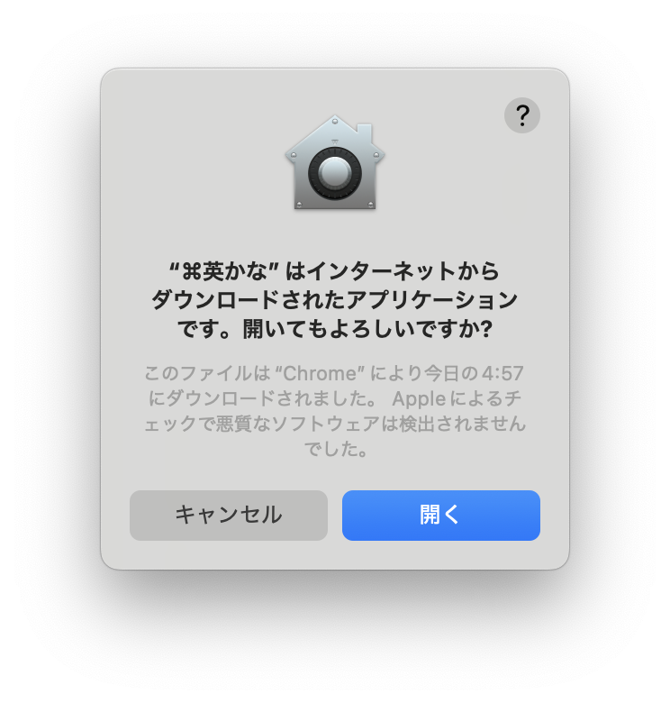
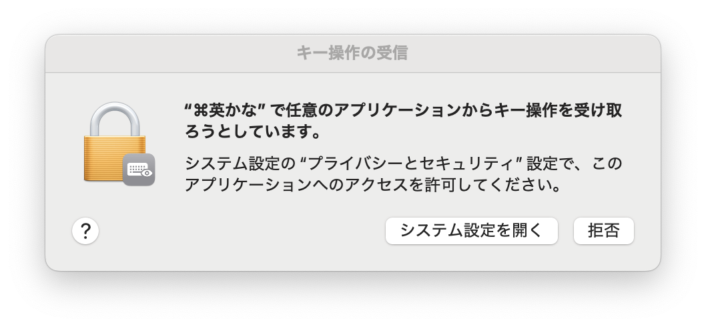
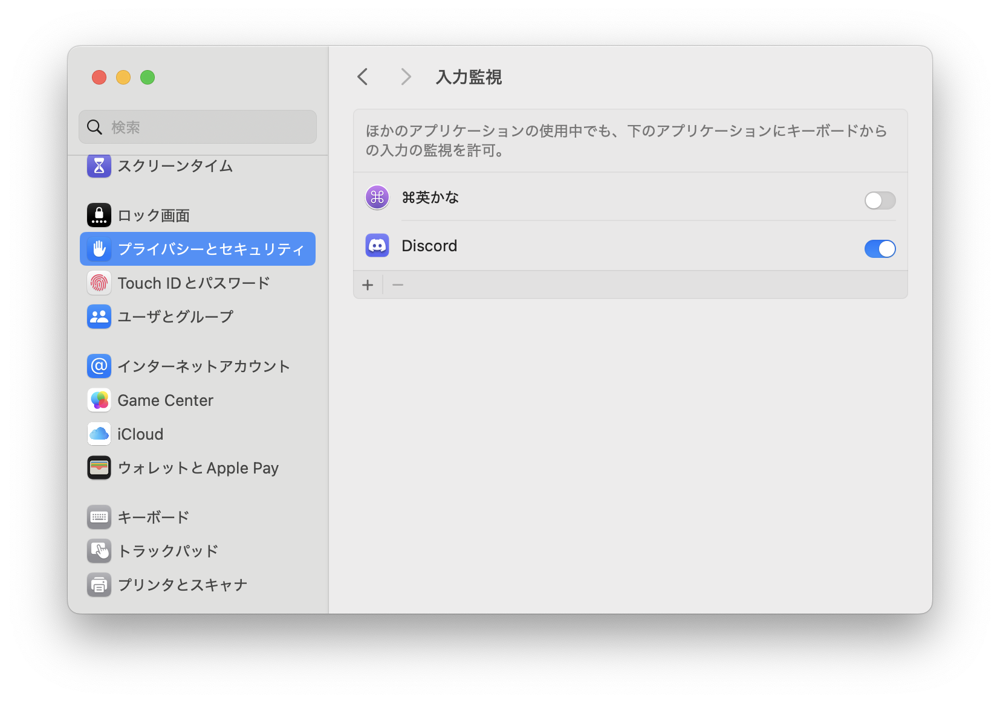
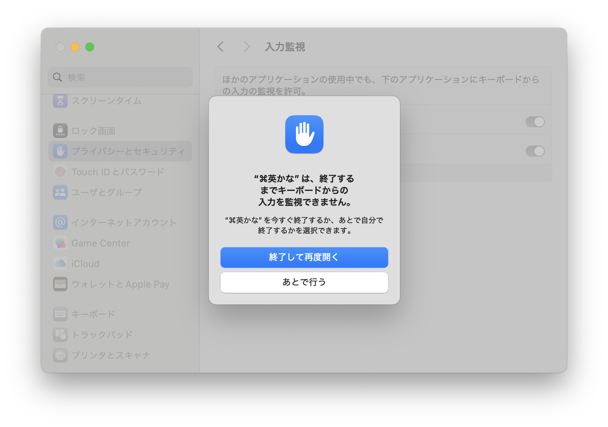
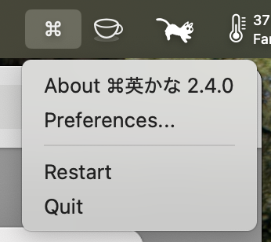

<div style="display: flex; align-items: center; gap: 16px;">
  
  <h1 style="margin: 0;">⌘英かな - Apple Silicon版</h1>
</div>

macOSで左右のコマンドキーを単体で押したときに英数/かなを切り替えるユーティリティです。USキーボードでもJISキーボードの「英数」「かな」キーと同様の操作感を実現できます。

macOS Sequoia (15) / Tahoe (26) に対応しています。

※ オリジナル版で発生していたTahoe (26) でメニューが反応しない・アプリが応答不能になる問題を修正しました。

本アプリケーションは [iMasanari/cmd-eikana](https://github.com/iMasanari/cmd-eikana) をApple Silicon向けにフォークしたものです。オリジナル版の詳細な説明は[公式サイト](https://ei-kana.appspot.com/)をご覧ください。

---

## ダウンロード

<div style="text-align: center; margin: 2em 0;">
  <a href="https://github.com/dominion525/cmd-eikana/releases/latest" style="display: inline-flex; align-items: center; background: #4a90d9; color: white; text-decoration: none; padding: 12px 24px; border-radius: 8px; font-size: 1.1em;">
    Download ⌘英かな-v2.4.0
    <span style="background: #666; color: white; padding: 4px 10px; border-radius: 4px; margin-left: 12px; font-size: 0.85em;">macOS 12.0+ / Apple Silicon</span>
  </a>
  <div style="margin-top: 1em;">
    <a href="https://github.com/dominion525/cmd-eikana">View project on GitHub</a>
  </div>
</div>

---

## キーバインド

| 入力 | 出力 | 備考 |
|:-----|:-----|:-----|
| 左⌘（単押し） | 英数 | 他のキーと組み合わせない場合 |
| 右⌘（単押し） | かな | 他のキーと組み合わせない場合 |
| ⌘ + 他のキー | 通常動作 | ショートカットとして機能 |

コマンドキーを単独で押して離したときに入力切り替えが発動します。⌘+C や ⌘+V などのショートカットは通常通り使用できます。

---

## 初回起動時の設定

本アプリはApple公証済みのため、通常のアプリと同様に起動できます。ただし、キー入力を監視するため、以下の権限設定が必要です。

### 1. アプリを開く

⌘英かな.appをダブルクリックすると、「インターネットからダウンロードされたアプリケーションです」という警告が表示されます。「**開く**」をクリックしてください。

<div style="text-align: center; margin: 1em 0;">
  
</div>

### 2. 入力監視の許可

起動すると「キー操作の受信」の許可を求めるダイアログが表示されます。「**システム設定を開く**」をクリックしてください。

<div style="text-align: center; margin: 1em 0;">
  
</div>

システム設定の「プライバシーとセキュリティ」→「入力監視」が開きます。⌘英かなのトグルをONにしてください。

<div style="text-align: center; margin: 1em 0;">
  
</div>

トグルをONにすると、再起動を求めるダイアログが表示されます。「**終了して再度開く**」をクリックしてください。

<div style="text-align: center; margin: 1em 0;">
  
</div>

アプリが自動的に再起動しますので、しばらくお待ちください。

### 3. アクセシビリティの許可

アプリが再起動すると、続いて「アクセシビリティ」の許可を求められます。システム設定の「プライバシーとセキュリティ」→「アクセシビリティ」で⌘英かなのトグルをONにしてください。

<div style="text-align: center; margin: 1em 0;">
  
</div>

### 4. アプリを再起動する

アクセシビリティの許可後、メニューバーの「⌘」アイコンをクリックして「**Quit**」を選択し、⌘英かなを一度終了してください。

<div style="text-align: center; margin: 1em 0;">
  
</div>

その後、再度⌘英かな.appを起動すると、キーリマップが有効になります。

---

## オリジナル版からの移行

オリジナル版（iMasanari/cmd-eikana）から移行する場合、Bundle IDが異なるためアクセシビリティの設定が競合することがあります。

1. オリジナル版の⌘英かなを終了
2. システム設定 →「プライバシーとセキュリティ」→「アクセシビリティ」を開く
3. 古い⌘英かなのエントリを削除（-ボタン）
4. 本フォーク版を起動し、新しくアクセシビリティを許可

### 上級者向け: ターミナルでの権限削除

オリジナル版の権限設定をターミナルで削除することもできます。

```bash
tccutil reset All io.github.imasanari.cmd-eikana
```

その後、本フォーク版を起動して新しく権限を許可してください。

---

## 終了方法

右上のステータスバーにある「⌘」アイコンをクリックし、「Quit」を選びます。

## アンインストール

⌘英かな.appをゴミ箱に入れてください。設定ファイル `~/Library/Preferences/io.github.dominion525.cmd-eikana.plist` も削除すると完全にアンインストールできます。

---

## クレジット

- オリジナル版: [iMasanari/cmd-eikana](https://github.com/iMasanari/cmd-eikana)
- オリジナル公式サイト: [https://ei-kana.appspot.com/](https://ei-kana.appspot.com/)

## ライセンス

MIT License
